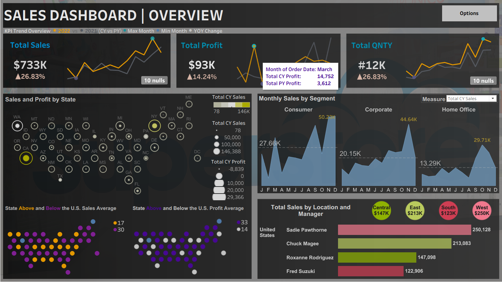
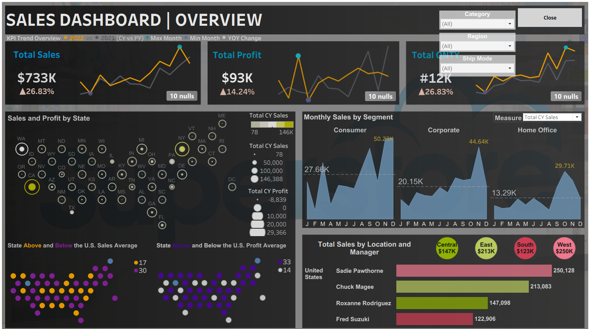

# Sales Dashboard | Tableau

## 📌 Project Overview

This project presents an interactive Sales Dashboard built using Tableau to analyze sales performance, profitability, and regional trends. The dashboard enables stakeholders to monitor key business metrics, compare year-over-year performance, and identify opportunities for growth.

---

## 🎯 Objectives

* Monitor overall sales and profit performance.
* Compare current year sales with previous year sales.
* Analyze sales distribution across U.S. states.
* Identify top-performing managers and regions.
* Understand monthly sales trends by customer segment.
* Track business KPIs for informed decision-making.

---

## 🛠️ Tools Used

* Tableau
* Microsoft Excel / CSV Dataset
* GitHub

---

## 📊 Key Performance Indicators (KPIs)

* **Total Sales:** $733K
* **Total Profit:** $93K
* **Total Quantity Sold:** 12K Units
* **Year-over-Year Sales Growth:** 26.83%
* **Year-over-Year Profit Growth:** 14.24%

---

## 📈 Dashboard Features

### KPI Trend Overview

Displays Total Sales, Profit, and Quantity with monthly trend comparisons between current and previous years.

### Sales and Profit by State

Interactive U.S. map highlighting sales and profit distribution across states, helping identify high-performing and underperforming regions.

### Monthly Sales by Segment

Analyzes monthly sales trends for:

* Consumer
* Corporate
* Home Office

### Sales by Location and Manager

Compares sales generated by regional managers and identifies top-performing regions.

### Interactive Filters

Users can dynamically filter data by:

* Category
* Region
* Ship Mode

---

## 🔍 Key Insights

* Sales increased by **26.83%** compared to the previous year.
* Profit experienced a **14.24% growth** year-over-year.
* The **West Region** generated the highest sales contribution.
* Consumer customers contributed the largest share of monthly sales.
* Significant differences exist in sales performance among regional managers.

---

## 📷 Dashboard Preview



---



---

## 📁 Repository Structure
```
Sales-Dashboard/

├── Sales_Dashboard_Overview.twbx

├── DataSets
    ├── Sales_Data.xls
    ├──hexmaps.xlsx

├── Images
    ├──Dashboard1.png
    ├──Dashboard2.png

├── background image

└── README.md
```
---

## 🚀 Conclusion

This project demonstrates skills in Tableau dashboard development, KPI monitoring, business performance analysis, and interactive data visualization. The dashboard provides actionable insights that support strategic business decisions and performance optimization.
